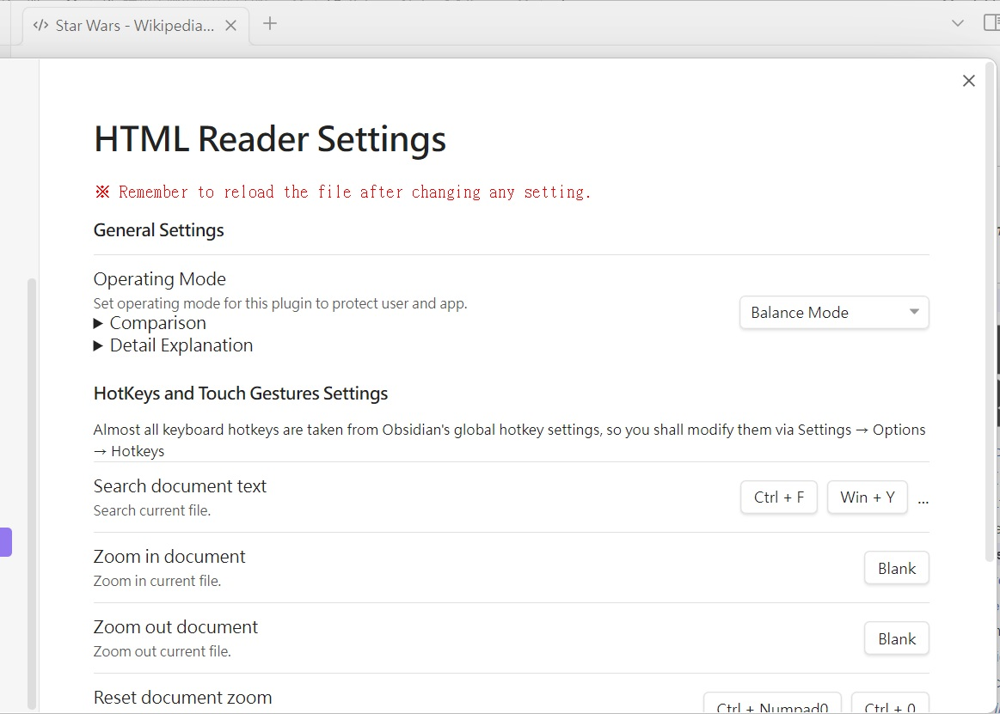

# Obsidian HTML reader Plugin

This is a plugin for Obsidian (https://obsidian.md). Can open document with `.html`  and `.htm` file extensions.

- [How to use](#how-to-use)
- [Install this plugin from Obsidian](#install-this-plugin-from-obsidian)
- [Manually installing the plugin](#manually-installing-the-plugin)
- [HTML Reader Settings](#html-reader-settings)
  - [General Settings](#general-settings)
  - [Hotkeys and Touch Gestures Settings](#hotkeys-and-touch-gestures-settings)
- [More Options](#more-options)
- [How to build this plugin from source code](#how-to-build-this-plugin-from-source-code)
- [Known issues](#known-issues)

## How to use

1. Put .html or .htm files to any obsidian-html-plugin installed vault folder
2. Click any HTML or HTM item to open it
3. Reading

## Install this plugin from Obsidian

1. Head to ⚙"Settings" ⇨ "Community plugins" options page, make sure "Restricted mode" is turned off.
2. Click `Browse` button to open Community plugins browsing dialog.
3. Search for this plugin "**HTML Reader**" and click the corresponding result item.
4. Click `Install` button to install this plugin.
5. Once installed, click `Enable` button to enable this plugin.
6. Or, enable this plugin "**HTML Reader**" from the "Installed plugins" list of "Community plugins" options page.

## Manually installing the plugin

1. Copy the `main.js` and `manifest.json` files from [Releases list](https://github.com/nuthrash/obsidian-html-plugin/releases) to your vault `<path>/<to>/<vaultFolder>/.obsidian/plugins/obsidian-html-plugin/`.
2. Relaunch Obsidian.
3. Head to ⚙"Settings" ⇨ "Community plugins" options page, make sure "Restricted mode" is turned off and enable this plugin "**HTML Reader**" from the "Installed plugins" list of "Community plugins" options page.

## HTML Reader Settings

1. Head to ⚙"Settings" ⇨ "Community plugins" options page, find the settings icon ⚙ of "**HTML Reader**" item, then click it.
2. Or, Head to ⚙"Settings" ⇨ click "**HTML Reader**" item on the bottom of left panel under the "Community plugins" group after enabled it.

 

### General Settings

#### Operating Mode

Set Operating Mode for this plugin to protect user and app.

#### Comparsion

|                          | Images | Styles  | Scripting             | DSD*  | CSP# | HTML Sanitization | Isolated |
|         ---:             | :---:  | :---:   | :---:                 | :---:            | :---: | :---: | :---: |
| **Text Mode**            | No     | No      | No                    | Yes              | Yes | Yes | Yes |
| **High Restricted Mode** | Yes[1] | Partial | No         | Yes              | Yes | Yes | Yes |
| **Balance Mode**         | Yes    | Yes     | No                    | Yes              | Yes | Yes | Yes |
| **Low Restricted Mode**  | Yes    | Yes     | Partial[2] | Yes              | No  | No  | Yes |
| **Unrestricted Mode**    | Yes    | Yes     | Yes[3]     | Yes              | No  | No  | Yes |

*: [Declarative Shadow DOM](https://web.dev/declarative-shadow-dom/)  
#: [Content Security Policy](https://en.wikipedia.org/wiki/Content_Security_Policy)  
[1]: The external image sources would be blocked by CSP. 
[2]: The script codes inside `<script>` and external script files are still not executable.  
[3]: The external script files may not executable due to Obsidian's limitation.  

<h4>Detail Explanation</h4>

1. **Text Mode** - Highly recommended for the files came from untrusted source! This mode almost sanitized all visual effects, script codes, and styles out. eanwhile, it keeps text parts for reading the content of HTML files with HTML layout elements.
2. **High Restricted Mode** - This mode recommended for the user who wants more security. It would keep custom elements but sanitize unsafe HTML elements out, as well as unsafe attributes and their contents. The external image sources would be blocked by CSP, and the images are only available from the HTML files themselves.
3. **Balance Mode** - This mode is the default mode for this plugin. It would keep all custom elements and HTML elements, but sanitize unsafe attributes and their contents out.
4. **Low Restricted Mode** - This mode would not sanitize anything, all elements and their content would be keeped. The script codes inside `<script>` still not executable, nor the external script files.
5. **Unrestricted Mode** - This mode is <ins> **very dangerous** and may cause the Obsidian app crash, **THE OBSIDIAN AND THIS PLUGIN CANNOT ASSUME RESPONSIBILITY OR LIABILITY FOR SWITCHING TO THIS MODE** </ins>. It would not sanitize anything, all elements and their content would be keeped. The Obsidian app itself might adjust something. The external script files may not executable due to Obsidian's limitation. Strongly recommended not switching to this mode for normal usage.

    If you encounter troubles after switch to this mode, it is recommended to take these recovery steps:
    - Turn back to previous file which can open normally.
    - <ins>Delete or move the bad opened file to trash can. Otherwise, Obsidian would still open it after re-launched</ins>.
    - Return to this settings page to switch another Operating Mode.
  
    Sometimes you still cannot see what you want, then you should check the content of HTML file. This mode is just leave the content alone (only <ins>adjust the external link anchor tags to let them open in default browser windows</ins>), but the file might has some self-contained security protection facilities (such as CSP) and they would block something to avoid XSS attacks. If you find something like `<meta http-equiv="Content-Security-Policy" />` inside the HTML file, it means the file is protected by CSP mechanism. You might
    - Modify or remove the CSP `<meta>` tag by hands.
    - Change the capture settings of the original web page saving app to disable CSP or something else, and re-save the web page.

<h4>Terms Explanation</h4>

	
This section would try to explain some terms used by Operating Mode more detail. You can ignore some terms without bold font face (they are technical terms).

1. **Style**s - It means HTML [CSS](https://en.wikipedia.org/wiki/CSS) styles. They are almost safe to use, but CSS Injection or CSS Keylogger would steal something, so some <ins> user [interactive elements](https://html.spec.whatwg.org/multipage/interactive-elements.html) would be disabled at **Balance Mode** and **High Restricted Mode** </ins>.
2. **Scripting** - It means [Javascript](https://en.wikipedia.org/wiki/Javascript) and very dangerous. Even some script codes would executable at **Low Restricted Mode** and **Unrestricted Mode**, this does not mean they can work very well. More complex of script codes, less chances they can work normally. <ins>If you want the script codes work as you wish, you shall rewrite them and related modules to satisfy Obsidian platform</ins>, because there are many different aspects between Obsidian platform and normal browsers.
3. **DSD** - It means [Declarative Shadow DOM](https://web.dev/declarative-shadow-dom/).
4. **CSP** - It means [Content Security Policy](https://en.wikipedia.org/wiki/Content_Security_Policy). It provides some “binding operational directives” to tell Obsidian how to treat some resources. Its rules are different with others used by normal browsers and websites, the `'self'` setting is almost meaningless for Obsidian.
5. **HTML Sanitization** - This mechanism would physically sanitize unsafe content out when loading HTML files, and there are different configurations among three modes. The sanitization configurations are progressive and may change with version iteration. If you think some tags or attributes shall not be sanitized, you can create a new issue in [Issues page](https://github.com/nuthrash/obsidian-html-plugin/issues) to let me know.
6. **Isolated** - The CSS styles of HTML files shall be isolated against with other parts of Obsidian, otherwise the Obsidian's layouts might be disarranged or font faces might become ugly. The disadvantages of CSS isolation might cause some CSS effects lost, such as `:target` pseudo-class event would never be fired. You can get more details from the [CSS Isolation](https://github.com/nuthrash/obsidian-html-plugin/wiki/CSS-Isolation) wiki page.
7. [Custom Element](https://developer.mozilla.org/docs/Web/Web_Components/Using_custom_elements) - It means the HTML tags look like `<xxx-yyy>` and they are often incorporated with related javascript codes. Therefore, when the scripting is disallowed, the custom HTML tags are almost useless and would act as pure containers.

 

### Hotkeys and touch gestures settings
Almost all keyboard hotkeys are taken from Obsidian's global hotkey settings, so you shall modify them via Settings → Options → Hotkeys.  
That means this plugin does not design any new configuration interface for keyboard hotkeys. And it just show the first two settings of corresponding hotkeys with readonly mode.

#### Search document text
Search current file.
#### Zoom in document
Zoom in current file.
#### Zoom out document
Zoom out current file.
#### Reset document zoom
Reset current file zoom.
#### Quick document zoom in and out
Zoom the document using Ctrl + Wheel (zoom in: ↑, zoom out: ↓), or using the trackpad/touch screen/touch panel two-finger pinch-zoom gesture (zoom in: ← →, zoom out: → ←).

## More options
After opening HTML files, the three dots "more options" menu icon on right-upper corner of tab would add some menu items.

 
### Find...
Open search bar.
### Zoom in
Zoom in current file.
### Zoom out
Zoom out current file.
### Reset zoom
Reset current file zoom.

## How to build this plugin from source code

1. Clone this project to your system.
2. Under the local project folder, key the command `npm i` to install necessary packages.(You need Node.js installed on your development environment)
3. Then run `npm run dev` would build the plugin files.

## Known issues

- Cannot see local image files like `` or ``
  - This is Obsidian's constraint, it disallow to directly access local files through HTML code.
  - One of the possible remedy ways is re-save the HTML file as a complete HTML file by dedicated browser extensions such as "[SingleFile](https://github.com/gildas-lormeau/SingleFile)", it can save a complete page (with CSS, images, fonts, frames, etc.) as a single HTML file. After got the complete HTML file, put it to obsidian-html-plugin installed vault folder then open it, you would see all images.
  - Another remedy way is add `app://local/` or `app://local//` prefix string to `src` attribute by hands(refer to "[Allow embed of Local images using ``](https://forum.obsidian.md/t/allow-embed-of-local-images-using-file/1990/4)").

- After some .html files were opened, they look like blank pages and cannot see original contents.
  - In fact, currently (after 1.0.4), this plugin can handle only some kinds of HTML files:
    1. Standard [HTML5](https://html.spec.whatwg.org/) files
    2. Compressed HTML-like files made by [SingleFileZ](https://github.com/gildas-lormeau/SingleFileZ)
  - Therefore, when open unsupported file format, this plugin would notice related messages or show an almost blank page.
  - "open document with `.html`  and `.htm` file extensions" is the description written for end-users without technical background. It doesn't mean this plugin can open all kinds of files with .html or .htm file extensions, especially when the file actually is other document type but renamed to .html or .htm file extension.
  - If you want to open an ePub file, you shall install "ePub Reader" plugin to open it, instead rename it to xxx.html then ask why this plugin cannot open it.

- Some HTML elements disappeared
  - That might be caused by:
    1. Removed by HTML Sanitization mechanism
    2. Hide or become invisible
  - You could try to switch [Operating Mode](#operating-mode) to different modes to see if the disappeared HTML elements become visibile. If YES, you could create a new issue in [Issues page](https://github.com/nuthrash/obsidian-html-plugin/issues) to let me know, and I will discuss it with you.
  - If you still cannot see the disappeared HTML elements after switching to less restricted modes, that means they were hide or became invisible. This situation often occurs when the HTML element use some advanced features like "[Declarative Shadow DOM](https://web.dev/declarative-shadow-dom/)" (this feature has been supported after verion 1.0.4) and this plugin or Obsidian not supported yet. Then, you could create a new issue in [Issues page](https://github.com/nuthrash/obsidian-html-plugin/issues) to let me know, and I will discuss it with you.

- Almost all script codes cannot work
  - That might be caused by:
    1. Blocked by HTML loading procedure
    2. Removed by HTML Sanitization mechanism
  - Obsidian's developer team is very concern about XSS attacks, so they want plugin developers follow this [tip](https://github.com/obsidianmd/obsidian-releases/blob/master/plugin-review.md#avoid-innerhtml-outerhtml-and-insertadjacenthtml) to prevent XSS attacks. Therefore, almost all script codes resident inside `<script>` in the HTML file would be blocked, and the external script files are the same.
  - Meanwhile, HTML Sanitization mechanism would sanitize potential XSS code more deeper. So, the code such as `<... onload="alert(1)">` would be removed.
  - Therefore, you could switch to [less restricted modes](#operating-mode) to see if they work or not.

- Cannot zoom in or out by mouse wheel on mobile platforms
  - It seems the Obsidian app block something on mobile platforms, so these actions would not work normally.
  - You could use two-finger pinch-zoom gesture on the touch screen to zoom in or out.
  - You could use the "[more options](#more-options)" menu items to zoom in or out.

- The zoom related hotkey settings are disappeared on mobile platforms
  - The mobile version of Obsidian does not provide these settings, so this plugin also not provide them.
  
- The presentation style of search results is different with Markdown documents
  - There are lots tags/elements inside HTML files, and some search results would across tags and overlap with each others. Therefore, this plugin use the block mark style (highlight with background color) instead outline style.
